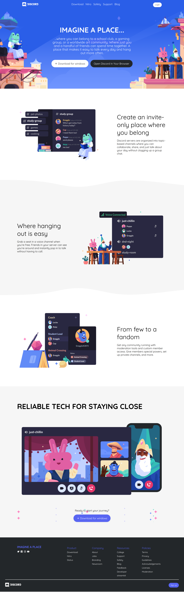

# Discord

discord landing page clone using html and css only

## Features

- Responsive design
- using BEM methodology for nameing css classes
- toggle menu in small devices without js
- use postcss ,autoprefixer and cssnano packages for better performance

[preview link](https://landing-page-discord.vercel.app/)

